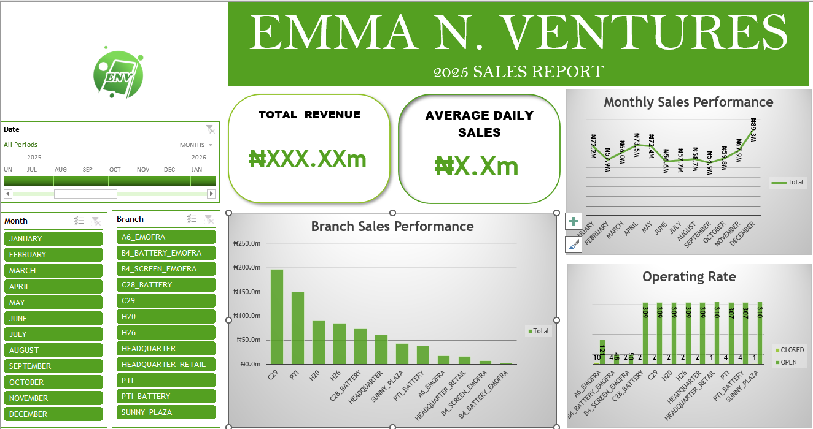

# Data Analytics Portfolio
Welcome to my Data Analytics Portfolio. This repository showcases projects where I analyze datasets, build dashboards, and generate insights that support data-driven decision making.
---

## Portfolio Projects

1. **Emma N. Ventures – 2025 Sales Performance Analysis**
   Interactive Excel dashboard analyzing revenue trends and branch performance.

# About Me
I am a Data Analyst with a background in Computer Engineering, passionate about transforming raw data into meaningful insights and strategic intelligence. My work focuses on:

* Business data analysis
* Dashboard development
* Data visualization
* Predictive analysis
* Translating analytical results into actionable insights

I currently work with tools such as **Excel**, and continue expanding my skills in SQL, Python, PowerBi, machine learning and AI-driven analytics.

---

# Tools & Technologies
* Microsoft Excel
* Data Visualization
* Business Analytics

---

# Projects

## 1. Emma N. Ventures – 2025 Sales Performance Analysis
This project analyzes the **2025 sales performance of Emma N. Ventures**, a multi-branch retail business. Using daily sales data, I developed an **interactive Excel dashboard** to evaluate revenue trends, branch performance, and operational efficiency.

### Key Analysis Areas
* Total annual revenue
* Average daily sales
* Monthly sales performance
* Branch sales contribution
* Branch operating rate

### Key Insights
* Revenue is concentrated in a few high-performing branches.
* Sales performance shows clear seasonal trends across the year.
* Some branches began operations later in the year, affecting revenue distribution.
* Sales growth exists but fluctuates across months.

### Tools Used
Microsoft Excel
Pivot Tables
Data Visualization
Dashboard Design

Full project presentation:
[Download Report](2025-Sales-Performance-Report.pptx)

### Dashboard Preview

**Note:** Certain financial values were modified for confidentiality while preserving the analytical structure.

---

# Contact

LinkedIn: *(https://www.linkedin.com/in/oshorakpor-ovie-448b67289?lipi=urn%3Ali%3Apage%3Ad_flagship3_profile_view_base_contact_details%3BLPJJpks3QwSl0S%2FlKxqRJw%3D%3D)*

GitHub: https://github.com/OviXTheAnalyst

Email: oshorpresh@gmail.com

---

More projects will be added as I continue developing advanced skills in **SQL, Python, PowerBi, machine learning and AI-driven analytics.**
